<!-- ============================================================ -->
<!--  NEEKOLAS  //  GitHub Profile README                         -->
<!--  Theme: Retro Terminal / Hacker  |  Accent: #ff6b35 (Fire)   -->
<!-- ============================================================ -->

<div align="center">

```
 ███╗   ██╗███████╗███████╗██╗  ██╗ ██████╗ ██╗      █████╗ ███████╗
 ████╗  ██║██╔════╝██╔════╝██║ ██╔╝██╔═══██╗██║     ██╔══██╗██╔════╝
 ██╔██╗ ██║█████╗  █████╗  █████╔╝ ██║   ██║██║     ███████║███████╗
 ██║╚██╗██║██╔══╝  ██╔══╝  ██╔═██╗ ██║   ██║██║     ██╔══██║╚════██║
 ██║ ╚████║███████╗███████╗██║  ██╗╚██████╔╝███████╗██║  ██║███████║
 ╚═╝  ╚═══╝╚══════╝╚══════╝╚═╝  ╚═╝ ╚═════╝ ╚══════╝╚═╝  ╚═╝╚══════╝
```

<a href="https://git.io/typing-svg"></a>


</div>

<!-- ===================== TERMINAL DIVIDER ===================== -->


```console
neekolas@github:~$ cat /etc/motd
```

```
 ╔══════════════════════════════════════════════════════════════════╗
 ║                                                                  ║
 ║   > Location:     South Carolina, USA                            ║
 ║   > Interests:    Reverse Engineering // 3D Printing // IoT      ║
 ║   > Currently:    Hacking 3D printer protocols                   ║
 ║   > Philosophy:   "If it has firmware, it can be modded."        ║
 ║                                                                  ║
 ╚══════════════════════════════════════════════════════════════════╝
```

<!-- ======================== ABOUT ME ========================= -->


```console
neekolas@github:~$ cat about.txt
```

<div align="left">

```yaml
name: Neekolas
located_in: SC, USA
current_project: AnkerMake M5 Protocol (2026 Edition)

fields_of_interest:
  - "Reverse Engineering"
  - "Protocol Analysis"
  - "3D Printing & Hardware Modding"
  - "IoT & Home Automation"
  - "Open Source Development"

currently_hacking:
  - "MQTT / PPPP / HTTPS printer protocols"
  - "G-code validation & streaming"
  - "PrusaSlicer integrations"
  - "Home Assistant custom components"

fun_fact: "I reverse-engineered a 3D printer's proprietary protocol and made it open source."
```

</div>

<!-- ======================= TECH STACK ======================== -->


```console
neekolas@github:~$ ls -la /skills/
```

<div align="center">

#### `// LANGUAGES`


#### `// TOOLS & PLATFORMS`


#### `// PROTOCOLS & COMMS`


</div>

<!-- ===================== CERTIFICATIONS ===================== -->


```console
neekolas@github:~$ ls -la /certifications/
```

<div align="center">

#### `// SECURITY & REVERSE ENGINEERING`


#### `// DEVELOPMENT & CLOUD`


</div>

```
  ┌─────────────────────────────────────────────────────────────┐
  │  Certification Details                                      │
  │                                                             │
  │  OSCP    -- Offensive Security Certified Professional       │
  │           Penetration testing with Kali Linux               │
  │                                                             │
  │  GREM    -- GIAC Reverse Engineering Malware                │
  │           Malware analysis & reverse engineering            │
  │                                                             │
  │  AWS CCP -- AWS Certified Cloud Practitioner                │
  │           Cloud fundamentals & architecture                 │
  │                                                             │
  │  GH-200  -- GitHub Actions                                   │
  │           CI/CD automation & workflow management             │
  └─────────────────────────────────────────────────────────────┘
```

<!-- ==================== FEATURED PROJECT ===================== -->


```console
neekolas@github:~$ cat /projects/featured.log
```

<div align="center">

<a href="https://github.com/neekolascmd/ankermake-m5-protocol">
  
</a>

</div>

```
  ┌─────────────────────────────────────────────────────────────┐
  │  AnkerMake M5 Protocol // 2026 Edition                      │
  │                                                             │
  │  > Reverse-engineered proprietary 3D printer protocol       │
  │  > CLI + Web UI for AnkerMake M5/M5C printers               │
  │  > PrusaSlicer integration & G-code streaming               │
  │  > MQTT/PPPP/HTTPS protocol implementations                 │
  │  > Camera streaming & Home Assistant component              │
  │  > 800+ commits deep                                        │
  │                                                             │
  │  Languages: Python // HTML // JavaScript // TeX             │
  └─────────────────────────────────────────────────────────────┘
```

<!-- ====================== GITHUB STATS ======================= -->


```console
neekolas@github:~$ neofetch --github
```

<div align="center">






</div>

<!-- ================== ACTIVITY GRAPH ========================= -->


```console
neekolas@github:~$ git log --graph --oneline
```

<div align="center">

[](https://github.com/ashutosh00710/github-readme-activity-graph)

</div>

<!-- ==================== CONTRIBUTION SNAKE =================== -->

<div align="center">

<picture>
  <source media="(prefers-color-scheme: dark)" srcset="https://raw.githubusercontent.com/neekolascmd/neekolascmd/output/github-snake-dark.svg" />
  <source media="(prefers-color-scheme: light)" srcset="https://raw.githubusercontent.com/neekolascmd/neekolascmd/output/github-snake.svg" />
  
</picture>

</div>

<!-- ======================== FOOTER =========================== -->


<div align="center">

```
  ┌─────────────────────────────────────────────────────────────┐
  │                                                             │
  │          "Talk is cheap. Show me the code."                 │
  │                              — Linus Torvalds               │
  │                                                             │
  └─────────────────────────────────────────────────────────────┘
```


</div>

<!-- ============================================================ -->
<!--  EOF  //  Built with obsession                                -->
<!-- ============================================================ -->
