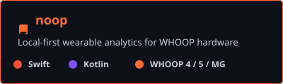

<!-- ============================================================ -->
<!--  NEEKOLAS  //  GitHub Profile README                         -->
<!--  Theme: Retro Terminal / Hacker  |  Accent: #ff6b35 (Fire)   -->
<!-- ============================================================ -->

<div align="center">

```
 ███╗   ██╗███████╗███████╗██╗  ██╗ ██████╗ ██╗      █████╗ ███████╗
 ████╗  ██║██╔════╝██╔════╝██║ ██╔╝██╔═══██╗██║     ██╔══██╗██╔════╝
 ██╔██╗ ██║█████╗  █████╗  █████╔╝ ██║   ██║██║     ███████║███████╗
 ██║╚██╗██║██╔══╝  ██╔══╝  ██╔═██╗ ██║   ██║██║     ██╔══██║╚════██║
 ██║ ╚████║███████╗███████╗██║  ██╗╚██████╔╝███████╗██║  ██║███████║
 ╚═╝  ╚═══╝╚══════╝╚══════╝╚═╝  ╚═╝ ╚═════╝ ╚══════╝╚═╝  ╚═╝╚══════╝
```

<a href="https://git.io/typing-svg"></a>


</div>

<!-- ===================== TERMINAL DIVIDER ===================== -->


```console
neekolas@github:~$ cat /etc/motd
```

```
 ╔══════════════════════════════════════════════════════════════════╗
 ║                                                                  ║
 ║   > Location:     South Carolina, USA                            ║
 ║   > Interests:    Wearable Interop // Health Analytics // Apps   ║
 ║   > Currently:    Maintaining NOOP for WHOOP 4 / 5 / MG          ║
 ║   > Philosophy:   "If it has firmware, it can be modded."        ║
 ║                                                                  ║
 ╚══════════════════════════════════════════════════════════════════╝
```

<!-- ======================== ABOUT ME ========================= -->


```console
neekolas@github:~$ cat about.txt
```

<div align="left">

```yaml
name: Neekolas
located_in: SC, USA
current_project: NOOP — local-first wearable analytics

fields_of_interest:
  - "Wearable Interoperability"
  - "Reverse Engineering & Protocol Analysis"
  - "On-Device Health Analytics"
  - "Cross-Platform App Development"
  - "Community Software Stewardship"

currently_hacking:
  - "WHOOP 4 / 5 / MG BLE interoperability"
  - "Swift + Kotlin analytics parity"
  - "On-device recovery, strain, HRV & sleep analysis"
  - "Hardware verification, CI & release reliability"

fun_fact: "I maintain a local-first wearable app that computes recovery and sleep metrics on-device."
```

</div>

<!-- ======================= TECH STACK ======================== -->


```console
neekolas@github:~$ ls -la /skills/
```

<div align="center">

#### `// LANGUAGES`


#### `// TOOLS & PLATFORMS`


#### `// WEARABLES & DATA`


</div>

<!-- ===================== CERTIFICATIONS ===================== -->


```console
neekolas@github:~$ ls -la /certifications/
```

<div align="center">

#### `// SECURITY & REVERSE ENGINEERING`


#### `// DEVELOPMENT & CLOUD`


</div>

```
  ┌─────────────────────────────────────────────────────────────┐
  │  Certification Details                                      │
  │                                                             │
  │  OSCP    -- Offensive Security Certified Professional       │
  │           Penetration testing with Kali Linux               │
  │                                                             │
  │  GREM    -- GIAC Reverse Engineering Malware                │
  │           Malware analysis & reverse engineering            │
  │                                                             │
  │  AWS CCP -- AWS Certified Cloud Practitioner                │
  │           Cloud fundamentals & architecture                 │
  │                                                             │
  │  GH-200  -- GitHub Actions                                   │
  │           CI/CD automation & workflow management             │
  └─────────────────────────────────────────────────────────────┘
```

<!-- ==================== FEATURED PROJECT ===================== -->


```console
neekolas@github:~$ cat /projects/featured.log
```

<div align="center">

<a href="https://github.com/neekolascmd/noop">
  
</a>

</div>

```
  ┌─────────────────────────────────────────────────────────────┐
  │  NOOP // Local-first wearable analytics                    │
  │                                                             │
  │  > macOS + iOS + Android app for WHOOP hardware             │
  │  > WHOOP 4 / 5 / MG BLE interoperability                    │
  │  > On-device recovery, strain, HRV & sleep analytics        │
  │  > Swift + Kotlin parity with shared analytics fixtures     │
  │  > Hardware verification, release & CI stewardship          │
  │  > Offline by design — no server, telemetry, or account     │
  │                                                             │
  │  Platforms: macOS // iOS // Android                         │
  └─────────────────────────────────────────────────────────────┘
```

<!-- ====================== GITHUB STATS ======================= -->


```console
neekolas@github:~$ neofetch --github
```

<div align="center">






</div>

<!-- ================== ACTIVITY GRAPH ========================= -->


```console
neekolas@github:~$ git log --graph --oneline
```

<div align="center">

[](https://github.com/ashutosh00710/github-readme-activity-graph)

</div>

<!-- ==================== CONTRIBUTION SNAKE =================== -->

<div align="center">

<picture>
  <source media="(prefers-color-scheme: dark)" srcset="https://raw.githubusercontent.com/neekolascmd/neekolascmd/output/github-snake-dark.svg" />
  <source media="(prefers-color-scheme: light)" srcset="https://raw.githubusercontent.com/neekolascmd/neekolascmd/output/github-snake.svg" />
  
</picture>

</div>

<!-- ======================== FOOTER =========================== -->


<div align="center">

```
  ┌─────────────────────────────────────────────────────────────┐
  │                                                             │
  │          "Talk is cheap. Show me the code."                 │
  │                              — Linus Torvalds               │
  │                                                             │
  └─────────────────────────────────────────────────────────────┘
```


</div>

<!-- ============================================================ -->
<!--  EOF  //  Built with obsession                                -->
<!-- ============================================================ -->
